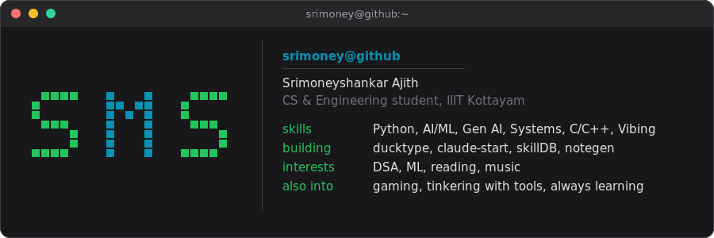

 

## About

CS & Engineering student at IIIT Kottayam. I spend most of my time building small dev tools and automations, doing DSA, and messing with my terminal setup more than is strictly necessary. Lately that's meant agentic AI systems, local LLMs, and Claude Code tooling. Outside of code I'm into reading, music, and gaming, and I'm generally just trying to learn something new whenever I can.

- 📍 Trivandrum, currently at IIIT Kottayam
- ✉️ [moneytosms@gmail.com](mailto:moneytosms@gmail.com)
- 🌐 Portfolio: [moneytosms.is-a.dev](https://moneytosms.is-a.dev/)
- 🧠 Learning: agentic AI, local LLM fine-tuning
- ✍️ Write occasionally on [Medium](http://www.medium.com/@moneytosms)

 

 

## Pinned

<table>
<tr>
<td width="33%" valign="top">

**[ducktype](https://github.com/moneytosms/ducktype)**
Monkeytype-quality typing practice, purpose-built for real code. Syntax highlighting, multi-line snippets, IDE mode.

</td>
<td width="33%" valign="top">

**[claude-start](https://github.com/moneytosms/claude-start)**
Opinionated Claude Code starter. Clone, run install, answer five questions, start building.

</td>
<td width="33%" valign="top">

**[offlineid](https://github.com/moneytosms/offlineid)**
Offline face recognition and liveness detection for field personnel in zero-network zones.

</td>
</tr>
<tr>
<td width="33%" valign="top">

**[skillDB](https://github.com/moneytosms/skillDB)**
Privacy-first AI resume builder. Local-first, no database, tailored ATS-friendly LaTeX CVs. [Live](https://skill-db.vercel.app/).

</td>
<td width="33%" valign="top">

**[notegen](https://github.com/moneytosms/notegen)**
Turns YouTube videos and web pages into structured Obsidian notes, with diagrams and wikilinks.

</td>
<td width="33%" valign="top">

**[Intro to CSE](https://github.com/moneytosms/Intro-to-CSE)** ★6
A no-fluff guide to surviving CS coursework. [Live site](https://intro-to-cse.vercel.app/).

</td>
</tr>
</table>

 

## Toolbox

**Languages**

**Frameworks & web**

**AI & agents**

**Databases**

**Security**

**Terminal, editor & everyday tools**

 

## Latest posts

<!-- BLOG-POST-LIST:START -->
<!-- BLOG-POST-LIST:END -->

 

## Elsewhere

 

## Stats

<table>
<tr>
<td width="50%" valign="top" align="center">

</td>
<td width="50%" valign="top" align="center">

</td>
</tr>
</table>

 

<picture>
  <source media="(prefers-color-scheme: dark)" srcset="https://raw.githubusercontent.com/moneytosms/moneytosms/output/github-contribution-grid-snake-dark.svg" />
  <source media="(prefers-color-scheme: light)" srcset="https://raw.githubusercontent.com/moneytosms/moneytosms/output/github-contribution-grid-snake.svg" />
  
</picture>

